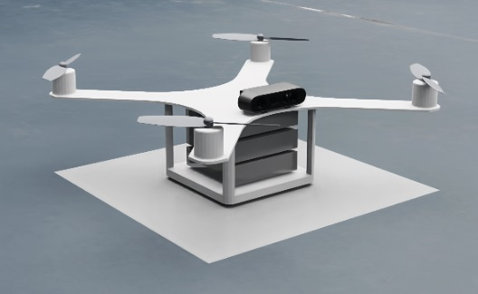
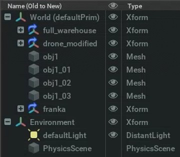
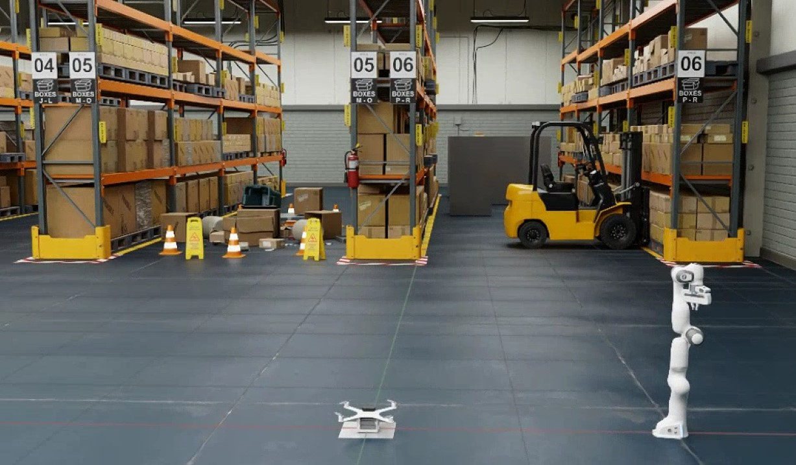

# Note

This repository is part of the code for the 4th 3DV competition simulation part from SCNU.

Another part of code could be found from [my another repository](https://github.com/EnderMandS/ego-planner).


The video actually carries a 16x speed. The green dot in the GIF above is a problem with video compression. For HD video [click here](https://www.bilibili.com/video/BV1r5411y7bu/).

The drone takes off from its point of origin. Autonomously navigates to the shelf number to take a picture. Then it goes around between the shelves and avoids the obstacles in the middle of the shelves. Finally return to the starting point.

------

# Run the Demo

The demo program is based on [NVIDIA Isaac Sim](https://developer.nvidia.cn/isaac-sim)(2023.1.1) and [ROS1 Noetic](https://wiki.ros.org/noetic).

The code and its required environments are deployed via [Docker](https://www.docker.com/), which makes the demo much easier to deploy. You don't even need to clone the repository to run the demo.

### Prerequisite

Make sure you have Isaac Sim, Docker and ROS1 installed.

### Get docker images

Get the docker images by running the following lines

```shell
docker pull endermands/orbbec_competition:latest
docker pull endermands/ego_planner:latest
```

If you want to make modifications, the image already has zsh and vim installed.

### Setup simulation stage

##### 1. Add warehouse to stage

Launch Isaac Sim with ROS1 Bridge Extension enable.

Create a new stage, then open the Isaac Assets tab and search for **full_warehouse**. Double click on full_warehouse in the search results and it should be loaded under the World. Add **PhysicsScene** by click Create -> Physics -> Physics Scene.

##### 2. Download drone USD file

Download **drone.zip** from the **IsaacAsset** folder in the repository. Unzip it to wherever you store your isaac models. This model is a drone model with basic ROS interface.

<div align=center></div>

##### 3. Import drone

In the Content tab navigate to the place where the drone model was unzipped in step 2. Drag and drop the drone.usd file to the World Xform. Select the drone and set the **Z** axis Orient to **90**. Make sure the drone's camera is facing the shelves.

##### 4. Add some obstacles(optional)

The drone will fly between two 06 shelves (with a forklift in the middle) and you can add some obstacles to block the drone from flying. Make sure there is enough space between the obstacles for the drone to travel through.

<div align=center></div>

##### Testing

Based on the above steps, your stage should look like this

<div align=center></div>

<div align=center></div>


Running `roscore` in a ROS sourced terminal.

Click the play button in Isaac Sim and you should see the drone's paddles begin to rotate.

Under the Stage tab expand World -> drone -> z and click on z_joint. Under the Property tab, find Physics -> Drive -> Linear. Set Target Position to 0.5 and you should see the drone take off. Remember to set Target Position back to 0 by clicking on the blue square to the right of the Target Position.

Type `rostopic list` in another ROS sourced terminal. You should be able to see some topics like camera, odom and joints.

##### Troublesome

If you have trouble creating the stage I can send you the full USD file(484MB).

------

## Start simulation Demo

1. Running `roscore` in a ROS sourced terminal.

2. Click the play button in Isaac Sim.

3. Open two terminals. Start the code for this repository in one of the terminals by running the following line.

```shell
docker run -it --rm --name isaac_tf --net host endermands/orbbec_competition:latest
```

​	A Volume is provided in this container. The pictures taken by the programme will be saved in this volume. You can specify the volume path by executing the following command in place of the previous one.

```shell
docker run -it --rm --name isaac_tf --net host -v /host/path:/home/m/code/ros_ws/image endermands/orbbec_competition:latest
```

4. In another terminals, running EGO-Planner.

```shell
docker run -it --rm --name ego_planner --net host endermands/ego_planner:latest
```

​	Notice that this docker image may change in the future and no longer work with the current repository code. You can find the current adapted version in another repository's release. Then rebuild the docker image, or compile it directly.

5. Let the programme fly for a while. You should see the drone take off and start navigating. You can also visualise paths and obstacles with Rviz. After the drone returns to the starting point you can find some pictures of the shelf number in the docker container volume.

------

## Compile

If you want to run the Demo without docker, compile this repository and [another repository](https://github.com/EnderMandS/ego-planner).

#### Prerequisite

Make sure you have ROS1 and OpenCV installed.

#### Dependencies

Replace your ROS distro in the following lines.

```shell
sudo apt update
sudo apt install -y ros-noetic-tf ros-noetic-tf2 ros-noetic-tf2-ros ros-noetic-cv-bridge
```

#### Clone & Build

Go to the project directory.

```shell
git clone --depth 1 https://github.com/EnderMandS/orbbec_competition.git
sudo chmod 777 -R orbbec_competition
cd orbbec_competition
source /opt/ros/noetic/setup.sh
catkin_make -DCATKIN_WHITELIST_PACKAGES="" -DCMAKE_BUILD_TYPE=Release
source devel/setup.sh
```

#### Run

In a ROS workspace sourced terminal run

```shell
roslaunch isaac_tf run.launch
```

